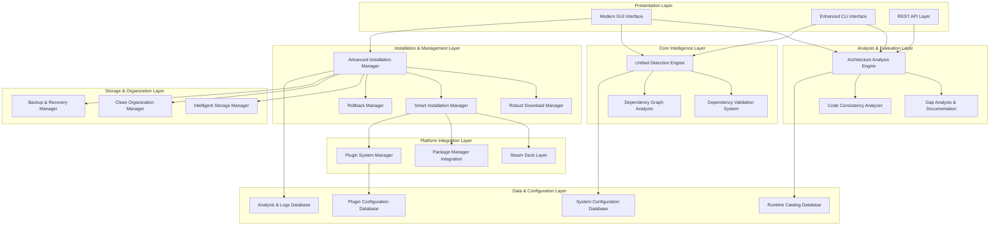
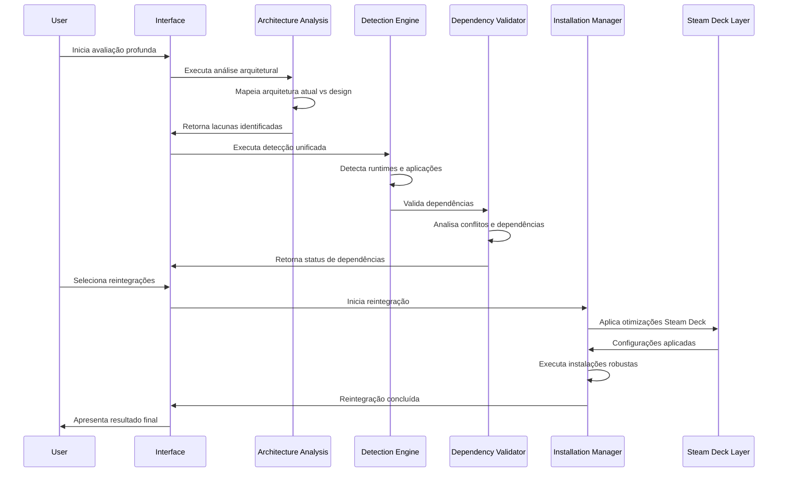

# Avaliação Profunda e Reintegração de Funcionalidades do Environment Dev - Design

## Overview

Este documento de design apresenta uma arquitetura abrangente para a avaliação profunda e reintegração de funcionalidades do Environment Dev. O sistema será transformado em uma solução robusta através de uma arquitetura de camadas que integra análise arquitetural, detecção unificada, validação inteligente de dependências, downloads seguros, otimizações Steam Deck, gestão de armazenamento, sistema de plugins e interface moderna.

O design foca na reconstrução coesa do sistema existente, mantendo compatibilidade com os 77+ componentes atuais enquanto adiciona funcionalidades críticas perdidas e implementa melhorias significativas de performance, segurança e experiência do usuário.

## Architecture

### Arquitetura Geral do Sistema



### Fluxo de Avaliação e Reintegração



## Components and Interfaces

### 1. Architecture Analysis Engine (AAE)

**Responsabilidade:** Análise completa da arquitetura atual e identificação de lacunas críticas.

**Interface:**
```python
class ArchitectureAnalysisEngine:
    def analyze_current_architecture(self) -> ArchitectureAnalysis
    def compare_with_design_documents(self, design_paths: List[str]) -> ComparisonResult
    def identify_critical_gaps(self) -> List[CriticalGap]
    def map_lost_functionalities(self) -> List[LostFunctionality]
    def generate_gap_analysis_report(self) -> GapAnalysisReport
    def prioritize_by_criticality(self, gaps: List[Gap]) -> List[PrioritizedGap]
    def validate_requirements_consistency(self, req_files: List[str]) -> ConsistencyResult
```

**Funcionalidades:**
- Mapeamento automático da arquitetura existente
- Comparação com documentos de design (design.md)
- Identificação de lacunas entre arquitetura proposta e implementação atual
- Verificação de coerência entre múltiplos requirements.md
- Documentação de funcionalidades perdidas
- Priorização por criticidade (segurança > estabilidade > funcionalidade > UX)

### 2. Unified Detection Engine (UDE)

**Responsabilidade:** Detecção completa e unificada de aplicativos, runtimes e dependências.

**Interface:**
```python
class UnifiedDetectionEngine:
    def detect_all_applications(self) -> DetectionResult
    def scan_registry_installations(self) -> List[RegistryApp]
    def detect_portable_applications(self) -> List[PortableApp]
    def detect_essential_runtimes(self) -> RuntimeDetectionResult
    def detect_package_managers(self) -> List[PackageManager]
    def detect_steam_deck_hardware(self) -> SteamDeckDetectionResult
    def apply_hierarchical_detection(self) -> HierarchicalResult
    def generate_comprehensive_report(self) -> ComprehensiveDetectionReport
```

**Detecção dos 8 Runtimes Essenciais:**
```python
class EssentialRuntimeDetector:
    def detect_git_2_47_1(self) -> GitDetectionResult
    def detect_dotnet_sdk_8_0(self) -> DotNetSDKResult
    def detect_java_jdk_21(self) -> JavaJDKResult
    def detect_vcpp_redistributables(self) -> VCppRedistResult
    def detect_anaconda3(self) -> AnacondaResult
    def detect_dotnet_desktop_runtime(self) -> DotNetDesktopResult
    def detect_powershell_7(self) -> PowerShell7Result
    def detect_updated_nodejs_python(self) -> UpdatedRuntimesResult
```

**Estratégia de Detecção Hierárquica:**
1. **Aplicações já instaladas** (prioridade máxima)
2. **Versões compatíveis** (verificação de compatibilidade)
3. **Localizações padrão do sistema** (paths conhecidos)
4. **Configurações personalizadas do usuário** (configurações específicas)

### 3. Dependency Validation System (DVS)

**Responsabilidade:** Sistema inteligente de validação de dependências com detecção de conflitos.

**Interface:**
```python
class DependencyValidationSystem:
    def create_dependency_graph(self, components: List[str]) -> DependencyGraph
    def analyze_direct_dependencies(self, component: str) -> List[Dependency]
    def analyze_transitive_dependencies(self, component: str) -> List[TransitiveDependency]
    def detect_version_conflicts(self, components: List[str]) -> List[VersionConflict]
    def detect_circular_dependencies(self, components: List[str]) -> List[CircularDependency]
    def calculate_resolution_path(self, conflicts: List[Conflict]) -> ResolutionPath
    def validate_contextual_compatibility(self, component: str) -> CompatibilityResult
    def suggest_alternatives(self, conflicts: List[Conflict]) -> List[Alternative]
```

**Dependency Graph Analyzer:**
```python
class DependencyGraphAnalyzer:
    def visualize_dependencies(self, graph: DependencyGraph) -> VisualizationResult
    def find_shortest_resolution_path(self, conflicts: List[Conflict]) -> Path
    def identify_critical_dependencies(self, graph: DependencyGraph) -> List[CriticalDependency]
    def optimize_installation_order(self, components: List[str]) -> List[str]
```

### 4. Robust Download Manager (RDM)

**Responsabilidade:** Sistema de download robusto com verificação obrigatória de integridade.

**Interface:**
```python
class RobustDownloadManager:
    def download_with_mandatory_hash_verification(self, url: str, expected_sha256: str) -> DownloadResult
    def implement_intelligent_mirror_system(self, mirrors: List[str]) -> MirrorResult
    def execute_configurable_retries(self, max_retries: int = 3) -> RetryResult
    def enable_parallel_downloads(self, components: List[str]) -> ParallelDownloadResult
    def generate_integrity_summary(self, downloads: List[Download]) -> IntegritySummary
    def implement_exponential_backoff(self, attempt: int) -> int
```

**Funcionalidades Avançadas:**
- Verificação obrigatória de hash SHA256 para todos os downloads
- Sistema de mirrors automáticos com fallback inteligente
- Retentativas configuráveis (máximo 3) com backoff exponencial
- Download paralelo para múltiplos componentes
- Resumo de integridade antes da instalação

### 5. Advanced Installation Manager (AIM)

**Responsabilidade:** Instalações robustas com rollback automático e configuração inteligente.

**Interface:**
```python
class AdvancedInstallationManager:
    def install_with_automatic_rollback(self, component: str) -> InstallationResult
    def configure_persistent_environment_variables(self, vars: Dict[str, str]) -> ConfigResult
    def validate_installation_with_specific_commands(self, component: str) -> ValidationResult
    def generate_detailed_success_failure_report(self) -> InstallationReport
    def handle_runtime_specific_cases(self, runtime: str) -> RuntimeSpecificResult
    def implement_intelligent_preparation(self, components: List[str]) -> PreparationResult
```

**Preparação Inteligente:**
```python
class IntelligentPreparationManager:
    def create_necessary_directory_structure(self, component: str) -> DirectoryResult
    def backup_existing_configurations(self, paths: List[str]) -> BackupResult
    def request_privileges_only_when_necessary(self, operation: str) -> PrivilegeResult
    def configure_critical_path_variables(self, component: str) -> PathConfigResult
```

### 6. Steam Deck Integration Layer (SDL)

**Responsabilidade:** Detecção e otimizações específicas para Steam Deck.

**Interface:**
```python
class SteamDeckIntegrationLayer:
    def detect_steam_deck_via_dmi_smbios(self) -> SteamDeckDetectionResult
    def apply_controller_specific_configurations(self) -> ControllerConfigResult
    def optimize_power_profiles(self) -> PowerOptimizationResult
    def configure_touchscreen_drivers(self) -> TouchscreenResult
    def integrate_with_glossi(self) -> GlosSIIntegrationResult
    def synchronize_via_steam_cloud(self) -> SteamCloudSyncResult
    def implement_fallback_detection(self) -> FallbackDetectionResult
```

**Detecção de Fallback:**
```python
class SteamDeckFallbackDetection:
    def use_steam_client_as_secondary_indicator(self) -> bool
    def allow_manual_configuration_for_edge_cases(self) -> ManualConfigResult
    def apply_generic_optimizations_if_detection_fails(self) -> GenericOptimizationResult
```

### 7. Intelligent Storage Manager (ISM)

**Responsabilidade:** Gestão inteligente de armazenamento para ambientes com espaço limitado.

**Interface:**
```python
class IntelligentStorageManager:
    def calculate_space_requirements_before_installation(self, components: List[str]) -> SpaceRequirement
    def enable_selective_installation_based_on_available_space(self, available: int) -> SelectiveInstallationResult
    def automatically_remove_temporary_files_after_installation(self) -> CleanupResult
    def suggest_components_for_removal_when_storage_low(self) -> RemovalSuggestions
    def intelligently_distribute_across_multiple_drives(self, drives: List[str]) -> DistributionResult
    def implement_intelligent_compression(self) -> CompressionResult
```

**Compressão Inteligente:**
```python
class IntelligentCompressionManager:
    def compress_rarely_accessed_components(self) -> CompressionResult
    def compress_previous_version_history(self) -> HistoryCompressionResult
    def compress_configuration_backups(self) -> BackupCompressionResult
```

### 8. Plugin System Manager (PSM)

**Responsabilidade:** Sistema de plugins extensível e seguro.

**Interface:**
```python
class PluginSystemManager:
    def implement_rigorous_structure_validation(self, plugin: Plugin) -> ValidationResult
    def provide_secure_api_with_sandboxing(self, plugin: Plugin) -> SecurityResult
    def automatically_detect_plugin_conflicts(self, plugins: List[Plugin]) -> ConflictDetectionResult
    def manage_versions_and_updates(self, plugin: Plugin) -> VersionManagementResult
    def verify_digital_signature_for_origin_verification(self, plugin: Plugin) -> SignatureVerificationResult
    def enable_addition_of_new_runtimes_via_plugins(self, plugin: Plugin) -> RuntimeAdditionResult
```

**Mecanismo de Integração:**
```python
class PluginIntegrationMechanism:
    def maintain_backward_compatibility(self, plugin: Plugin) -> CompatibilityResult
    def provide_clear_plugin_status_feedback(self, plugin: Plugin) -> StatusFeedback
    def implement_plugin_sandboxing(self, plugin: Plugin) -> SandboxResult
```

### 9. Modern Frontend with Excellent UX/CX

**Responsabilidade:** Interface moderna com excelente experiência do usuário.

**Interface:**
```python
class ModernFrontendManager:
    def design_unified_interface_with_clear_dashboard(self) -> InterfaceDesignResult
    def show_detailed_real_time_progress(self, operation: str) -> ProgressDisplayResult
    def organize_components_by_category_and_status(self) -> OrganizationResult
    def offer_intelligent_suggestions_based_on_diagnosis(self, diagnosis: DiagnosisResult) -> SuggestionResult
    def allow_granular_component_selection(self) -> SelectionResult
    def implement_feedback_system_with_severity_categorization(self) -> FeedbackSystemResult
```

**Otimizações Steam Deck:**
```python
class SteamDeckUIOptimizations:
    def implement_adaptive_interface_for_touchscreen_mode(self) -> TouchscreenUIResult
    def optimize_controls_for_gamepad(self) -> GamepadOptimizationResult
    def implement_overlay_mode_for_use_during_games(self) -> OverlayModeResult
    def optimize_battery_consumption_in_interface(self) -> BatteryOptimizationResult
```

## Data Models

### Architecture Analysis Model

```python
@dataclass
class ArchitectureAnalysis:
    current_architecture: ArchitectureMap
    design_architecture: ArchitectureMap
    identified_gaps: List[CriticalGap]
    lost_functionalities: List[LostFunctionality]
    consistency_issues: List[ConsistencyIssue]
    prioritized_fixes: List[PrioritizedFix]
    analysis_timestamp: datetime
```

### Unified Detection Result Model

```python
@dataclass
class UnifiedDetectionResult:
    registry_applications: List[RegistryApp]
    portable_applications: List[PortableApp]
    essential_runtimes: EssentialRuntimesStatus
    package_managers: List[PackageManager]
    steam_deck_detection: SteamDeckDetectionResult
    hierarchical_priorities: HierarchicalPriorities
    detection_confidence: float
    detection_timestamp: datetime
```

### Dependency Graph Model

```python
@dataclass
class DependencyGraph:
    nodes: List[DependencyNode]
    edges: List[DependencyEdge]
    direct_dependencies: Dict[str, List[str]]
    transitive_dependencies: Dict[str, List[str]]
    version_conflicts: List[VersionConflict]
    circular_dependencies: List[CircularDependency]
    resolution_path: Optional[ResolutionPath]
```

### Steam Deck Profile Model

```python
@dataclass
class SteamDeckProfile:
    hardware_detected: bool
    detection_method: DetectionMethod
    controller_configuration: ControllerConfig
    power_optimization: PowerProfile
    touchscreen_configuration: TouchscreenConfig
    glossi_integration: GlosSIConfig
    steam_cloud_sync: SteamCloudConfig
    fallback_applied: bool
```

### Installation State Model

```python
@dataclass
class AdvancedInstallationState:
    component: str
    installation_status: InstallationStatus
    progress_percentage: float
    current_step: str
    rollback_info: Optional[RollbackInfo]
    environment_variables_configured: Dict[str, str]
    validation_results: List[ValidationResult]
    runtime_specific_configurations: Dict[str, Any]
    installation_report: InstallationReport
```

## Error Handling

### Hierarquia de Exceções Expandida

```python
class EnvironmentDevDeepEvaluationError(Exception):
    """Base exception for Environment Dev Deep Evaluation"""
    pass

class ArchitectureAnalysisError(EnvironmentDevDeepEvaluationError):
    """Errors during architecture analysis"""
    pass

class UnifiedDetectionError(EnvironmentDevDeepEvaluationError):
    """Errors during unified detection"""
    pass

class DependencyValidationError(EnvironmentDevDeepEvaluationError):
    """Errors during dependency validation"""
    pass

class RobustDownloadError(EnvironmentDevDeepEvaluationError):
    """Errors during robust download operations"""
    pass

class AdvancedInstallationError(EnvironmentDevDeepEvaluationError):
    """Errors during advanced installation"""
    pass

class SteamDeckIntegrationError(EnvironmentDevDeepEvaluationError):
    """Errors during Steam Deck integration"""
    pass

class IntelligentStorageError(EnvironmentDevDeepEvaluationError):
    """Errors during intelligent storage management"""
    pass

class PluginSystemError(EnvironmentDevDeepEvaluationError):
    """Errors during plugin system operations"""
    pass
```

### Estratégia de Tratamento Avançada

1. **Análise de Causa Raiz:** Identificação automática da causa raiz de falhas
2. **Recovery Inteligente:** Tentativas automáticas de recuperação baseadas no tipo de erro
3. **Rollback Granular:** Rollback específico por componente ou operação
4. **Logging Estruturado:** Logs detalhados com contexto completo para debugging
5. **Feedback Acionável:** Mensagens de erro com soluções específicas e passos de resolução

## Testing Strategy

### Testes de Avaliação Arquitetural

- **Análise de Cobertura:** Verificação de que todos os componentes são analisados
- **Detecção de Lacunas:** Validação da precisão na identificação de lacunas
- **Consistência de Requisitos:** Testes de validação de consistência entre documentos
- **Priorização:** Verificação da correta priorização por criticidade

### Testes de Detecção Unificada

- **Detecção de Runtimes:** Testes para cada um dos 8 runtimes essenciais
- **Detecção Hierárquica:** Validação da priorização correta
- **Detecção Steam Deck:** Testes em hardware real e simulado
- **Detecção de Conflitos:** Cenários complexos de conflitos de dependências

### Testes de Instalação Robusta

- **Rollback Automático:** Testes de falha induzida para validar rollback
- **Configuração de Ambiente:** Verificação de variáveis de ambiente
- **Validação Pós-Instalação:** Testes de comandos específicos de validação
- **Cenários de Falha:** Testes extensivos de cenários de falha

### Testes de Performance

- **Diagnóstico < 15 segundos:** Benchmarks de tempo de diagnóstico
- **Downloads Paralelos:** Testes de eficiência de download
- **Otimização Steam Deck:** Testes de consumo de recursos
- **Responsividade da Interface:** Testes de responsividade durante operações

### Testes de Segurança

- **Verificação de Hash:** Testes de integridade de downloads
- **Sandboxing de Plugins:** Testes de isolamento de plugins
- **Validação de Assinatura:** Testes de verificação de assinatura digital
- **Privilege Escalation:** Testes de solicitação mínima de privilégios

## Performance Considerations

### Otimizações de Diagnóstico

- **Diagnóstico Paralelo:** Execução paralela de diferentes tipos de detecção
- **Cache Inteligente:** Cache de resultados de detecção para acelerar execuções subsequentes
- **Detecção Incremental:** Detecção apenas de mudanças desde a última execução
- **Priorização de Detecção:** Detecção prioritária de componentes críticos

### Otimizações de Download

- **Download Paralelo Inteligente:** Balanceamento de carga entre downloads simultâneos
- **Compressão de Transferência:** Uso de compressão para reduzir tempo de download
- **Mirror Selection Inteligente:** Seleção automática do mirror mais rápido
- **Resume Capability:** Capacidade de retomar downloads interrompidos

### Otimizações Steam Deck

- **Gestão Térmica:** Monitoramento e resposta a condições térmicas
- **Otimização de Bateria:** Minimização de processos em background
- **Gestão de Memória:** Uso eficiente de memória em cenários de RAM limitada
- **Otimização de Armazenamento:** Otimização para características de armazenamento do Steam Deck

## Security Considerations

### Segurança de Downloads

- **Verificação Obrigatória de Hash:** SHA256 obrigatório para todos os downloads
- **Validação de Certificados:** Verificação rigorosa de certificados SSL/TLS
- **Mirror Validation:** Validação de autenticidade de mirrors
- **Malware Scanning:** Integração opcional com sistemas antivírus

### Segurança do Sistema de Plugins

- **Assinatura Digital:** Verificação obrigatória de assinatura para plugins
- **Sandboxing Rigoroso:** Execução de plugins em ambiente isolado
- **API Whitelist:** Lista restrita de operações permitidas para plugins
- **Auditoria de Plugins:** Log detalhado de todas as operações de plugins

### Segurança de Instalação

- **Privilege Minimization:** Solicitação de privilégios apenas quando absolutamente necessário
- **Atomic Operations:** Operações atômicas para prevenir estados inconsistentes
- **Backup Automático:** Backup automático antes de modificações críticas
- **Validation Chain:** Cadeia de validação para todas as operações críticas

### Segurança de Dados

- **Criptografia de Configurações:** Criptografia de configurações sensíveis
- **Log Sanitization:** Remoção automática de informações sensíveis dos logs
- **Secure Storage:** Armazenamento seguro de backups e configurações
- **Audit Trail:** Trilha de auditoria completa para todas as operações críticas