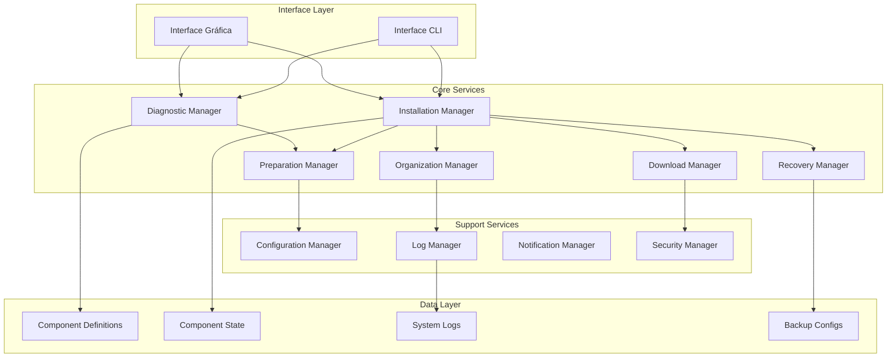
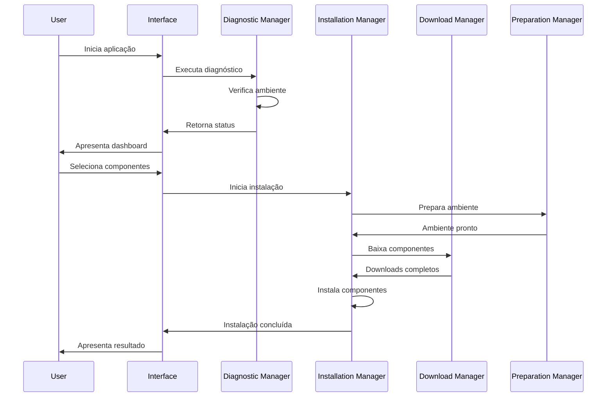

# Plano de Sucesso para Environment Dev - Design

## Overview

O design proposto transforma o Environment Dev em uma solução robusta e confiável através de uma arquitetura modular aprimorada, com foco em diagnóstico inteligente, downloads seguros, instalações confiáveis e interface intuitiva. O sistema será reestruturado para eliminar os problemas críticos identificados e implementar as funcionalidades necessárias para o sucesso.

## Architecture

### Arquitetura Geral



### Fluxo Principal de Operação



## Components and Interfaces

### 1. Diagnostic Manager

**Responsabilidade:** Diagnóstico completo do ambiente e detecção de problemas.

**Interface:**
```python
class DiagnosticManager:
    def run_full_diagnostic(self) -> DiagnosticResult
    def check_system_compatibility(self) -> CompatibilityResult
    def detect_conflicts(self, components: List[str]) -> ConflictResult
    def suggest_solutions(self, issues: List[Issue]) -> List[Solution]
    def verify_dependencies(self, component: str) -> DependencyResult
```

**Funcionalidades:**
- Verificação de sistema operacional e versão
- Detecção de software conflitante
- Verificação de dependências
- Análise de espaço em disco
- Verificação de permissões
- Detecção de problemas de rede

### 2. Download Manager

**Responsabilidade:** Downloads seguros com verificação de integridade.

**Interface:**
```python
class DownloadManager:
    def download_with_verification(self, url: str, expected_hash: str) -> DownloadResult
    def download_with_mirrors(self, mirrors: List[str]) -> DownloadResult
    def verify_file_integrity(self, file_path: str, expected_hash: str) -> bool
    def cleanup_failed_downloads(self) -> None
    def get_download_progress(self, download_id: str) -> ProgressInfo
```

**Funcionalidades:**
- Download com verificação de checksum/hash
- Sistema de mirrors automático
- Retry automático em caso de falha
- Progress tracking detalhado
- Limpeza automática de downloads falhos

### 3. Preparation Manager

**Responsabilidade:** Preparação inteligente do ambiente.

**Interface:**
```python
class PreparationManager:
    def prepare_environment(self, components: List[str]) -> PreparationResult
    def create_directory_structure(self, component: str) -> bool
    def backup_existing_configs(self, paths: List[str]) -> BackupResult
    def configure_environment_variables(self, vars: Dict[str, str]) -> bool
    def check_and_request_permissions(self, required_perms: List[str]) -> bool
```

**Funcionalidades:**
- Criação automática de diretórios
- Backup de configurações existentes
- Configuração de variáveis de ambiente
- Gerenciamento de permissões
- Preparação de dependências

### 4. Installation Manager

**Responsabilidade:** Instalações robustas com rollback automático.

**Interface:**
```python
class InstallationManager:
    def install_component(self, component: str) -> InstallationResult
    def install_multiple(self, components: List[str]) -> BatchInstallationResult
    def verify_installation(self, component: str) -> VerificationResult
    def rollback_installation(self, component: str) -> RollbackResult
    def detect_circular_dependencies(self, components: List[str]) -> bool
```

**Funcionalidades:**
- Instalação com rollback automático
- Detecção de dependências circulares
- Verificação pós-instalação
- Instalação em lote com ordem correta
- Recovery automático de falhas

### 5. Organization Manager

**Responsabilidade:** Manutenção de diretórios limpos e organizados.

**Interface:**
```python
class OrganizationManager:
    def cleanup_temporary_files(self) -> CleanupResult
    def organize_downloads(self) -> None
    def rotate_logs(self) -> None
    def manage_backups(self) -> BackupManagementResult
    def optimize_disk_usage(self) -> OptimizationResult
```

**Funcionalidades:**
- Limpeza automática de arquivos temporários
- Organização de downloads
- Rotação de logs
- Gerenciamento de backups
- Otimização de espaço em disco

### 6. Recovery Manager

**Responsabilidade:** Ferramentas de recuperação e manutenção.

**Interface:**
```python
class RecoveryManager:
    def auto_repair_issues(self, issues: List[Issue]) -> RepairResult
    def restore_from_backup(self, backup_id: str) -> RestoreResult
    def update_components(self, components: List[str]) -> UpdateResult
    def fix_inconsistencies(self) -> FixResult
    def generate_health_report(self) -> HealthReport
```

**Funcionalidades:**
- Reparo automático de problemas
- Restauração de backups
- Atualização de componentes
- Correção de inconsistências
- Relatórios de saúde do sistema

## Data Models

### Component Definition
```python
@dataclass
class ComponentDefinition:
    name: str
    category: str
    description: str
    version: str
    download_url: str
    mirrors: List[str]
    hash_value: str
    hash_algorithm: str
    install_method: str
    install_args: List[str]
    dependencies: List[str]
    conflicts: List[str]
    verify_actions: List[VerifyAction]
    post_install_actions: List[Action]
    system_requirements: SystemRequirements
```

### Installation State
```python
@dataclass
class InstallationState:
    component: str
    status: InstallationStatus
    progress: float
    current_step: str
    start_time: datetime
    end_time: Optional[datetime]
    error_message: Optional[str]
    rollback_info: Optional[RollbackInfo]
```

### Diagnostic Result
```python
@dataclass
class DiagnosticResult:
    system_info: SystemInfo
    compatibility: CompatibilityStatus
    issues: List[Issue]
    suggestions: List[Solution]
    overall_health: HealthStatus
    timestamp: datetime
```

## Error Handling

### Hierarquia de Exceções
```python
class EnvironmentDevError(Exception):
    """Base exception for Environment Dev"""
    pass

class DiagnosticError(EnvironmentDevError):
    """Errors during system diagnosis"""
    pass

class DownloadError(EnvironmentDevError):
    """Errors during download operations"""
    pass

class InstallationError(EnvironmentDevError):
    """Errors during installation"""
    pass

class RollbackError(EnvironmentDevError):
    """Errors during rollback operations"""
    pass
```

### Estratégia de Tratamento
1. **Captura Específica:** Cada módulo captura suas exceções específicas
2. **Logging Estruturado:** Todos os erros são logados com contexto completo
3. **Recovery Automático:** Tentativas automáticas de recuperação quando possível
4. **Feedback ao Usuário:** Mensagens claras e acionáveis para o usuário
5. **Rollback Automático:** Reversão automática em caso de falhas críticas

## Testing Strategy

### Testes Unitários
- **Cobertura:** Mínimo 85% de cobertura de código
- **Foco:** Cada componente testado isoladamente
- **Mocks:** Uso extensivo de mocks para dependências externas
- **Casos:** Testes para cenários normais e de erro

### Testes de Integração
- **Fluxos Completos:** Teste de fluxos end-to-end
- **Comunicação:** Teste de comunicação entre componentes
- **Estados:** Teste de transições de estado
- **Rollback:** Teste de cenários de rollback

### Testes de Sistema
- **Ambientes:** Teste em diferentes sistemas operacionais
- **Cenários Reais:** Teste com componentes reais
- **Performance:** Teste de performance e uso de recursos
- **Stress:** Teste com múltiplas instalações simultâneas

### Testes de Interface
- **Usabilidade:** Teste de fluxos de usuário
- **Responsividade:** Teste de responsividade da interface
- **Acessibilidade:** Teste de acessibilidade
- **Cross-platform:** Teste em diferentes resoluções e sistemas

### Automação de Testes
- **CI/CD:** Integração com GitHub Actions
- **Testes Automáticos:** Execução automática em PRs
- **Relatórios:** Geração automática de relatórios de cobertura
- **Quality Gates:** Bloqueio de merges com falhas de teste

## Security Considerations

### Download Security
- **Hash Verification:** Verificação obrigatória de hash para todos os downloads
- **HTTPS Only:** Apenas downloads via HTTPS
- **Certificate Validation:** Validação de certificados SSL
- **Malware Scanning:** Integração opcional com antivírus

### Execution Security
- **Privilege Escalation:** Solicitação de privilégios apenas quando necessário
- **Sandboxing:** Execução de instaladores em ambiente controlado
- **Input Validation:** Validação rigorosa de todos os inputs
- **Path Traversal:** Proteção contra ataques de path traversal

### Data Security
- **Configuration Encryption:** Criptografia de configurações sensíveis
- **Log Sanitization:** Remoção de informações sensíveis dos logs
- **Backup Security:** Backups protegidos com permissões adequadas
- **Audit Trail:** Trilha de auditoria para todas as operações críticas