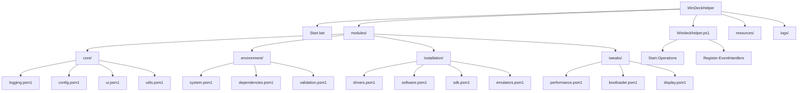

# Diretrizes de IA - WinDeckHelper

**Versão:** 1.1.0 (Atualizado para Estrutura Modular)

## 1. Visão Geral

Este documento estabelece as diretrizes para modelos de IA trabalharem no projeto WinDeckHelper, focando em:

* Compreensão da estrutura modular do projeto
* Padrões de modificação de código
* Processos de validação
* Diretrizes específicas para interação com o código

## 2. Estrutura do Projeto

### 2.1 Mapa de Componentes



### 2.2 Componentes Principais

| Componente | Responsabilidade | Restrições | Validações Necessárias |
|------------|------------------|------------|------------------------|
| `Start.bat` | Inicialização com privilégios | Não modificar parâmetros de execução | Verificar permissões de admin |
| `Windeckhelper.ps1` | Script orquestrador | Manter estrutura de módulos | Testar todas as funções modificadas |
| `modules/core/` | Funcionalidades centrais | Manter interfaces consistentes | Verificar compatibilidade entre módulos |
| `modules/environment/` | Verificação de ambiente | Validar requisitos mínimos | Testar em diferentes configurações |
| `modules/installation/` | Instalação de componentes | Manter idempotência | Verificar sucesso da instalação |
| `modules/tweaks/` | Ajustes do sistema | Documentar alterações | Testar reversibilidade |
| `resources/` | Recursos estáticos | Validar integridade | Verificar disponibilidade |
| `logs/` | Armazenamento de logs | Limitar tamanho | Verificar permissões de escrita |

## 3. Diretrizes de Modificação

### 3.1 Módulos PowerShell

* **Padrão de Implementação de Módulos:**
```powershell
# Nome do módulo: [nome-do-módulo].psm1

function Verb-Noun {
    param(
        [Parameter(Mandatory=$true)]
        [string]$RequiredParam,
        
        [Parameter(Mandatory=$false)]
        [string]$OptionalParam = "DefaultValue"
    )
    
    # Importa dependências internas se necessário
    Import-Module "$PSScriptRoot\..\core\logging.psm1"
    
    try {
        # Implementação da função
        Write-Log "Executando Verb-Noun" -Level "INFO"
        
        # Retorno consistente
        return $true
    }
    catch {
        $errorMsg = $_.Exception.Message
        Write-Log "Erro em Verb-Noun: $errorMsg" -Level "ERROR"
        return $false
    }
}

# Exporta apenas as funções que devem ser públicas
Export-ModuleMember -Function Verb-Noun
```

### 3.2 Validações Obrigatórias

* Verificar existência de diretórios antes de instalação
* Validar URLs de download
* Confirmar versões de pacotes
* Testar permissões de escrita
* Verificar dependências entre módulos
* Validar parâmetros de entrada das funções

## 4. Áreas de Responsabilidade

### 4.1 Módulos Core

* **logging.psm1**
  - Implementar sistema de logs consistente
  - Garantir rotação de logs
  - Fornecer níveis de log (INFO, WARNING, ERROR, SUCCESS, DEBUG)

* **config.psm1**
  - Gerenciar configurações globais
  - Carregar configurações de arquivos externos
  - Validar configurações

* **ui.psm1**
  - Implementar componentes de interface
  - Gerenciar feedback visual
  - Padronizar interações com usuário

* **utils.psm1**
  - Fornecer funções utilitárias
  - Implementar operações comuns
  - Abstrair complexidades

### 4.2 Módulos Environment

* **system.psm1**
  - Verificar requisitos do sistema
  - Validar privilégios
  - Coletar informações do ambiente

* **dependencies.psm1**
  - Verificar dependências externas
  - Validar versões de componentes
  - Resolver conflitos

* **validation.psm1**
  - Implementar validações específicas
  - Verificar integridade do sistema
  - Garantir compatibilidade

### 4.3 Módulos Installation

* **drivers.psm1**
  - Instalar drivers específicos
  - Verificar compatibilidade com hardware
  - Validar assinaturas digitais

* **software.psm1**
  - Gerenciar instalação de pacotes
  - Implementar verificações de versão
  - Garantir instalação silenciosa

* **sdk.psm1**
  - Instalar SDKs de desenvolvimento
  - Configurar variáveis de ambiente
  - Validar dependências cruzadas

* **emulators.psm1**
  - Instalar emuladores
  - Configurar ROMs e BIOSes
  - Otimizar desempenho

### 4.4 Módulos Tweaks

* **performance.psm1**
  - Aplicar otimizações de desempenho
  - Ajustar configurações do sistema
  - Monitorar impacto

* **bootloader.psm1**
  - Configurar bootloader
  - Gerenciar opções de inicialização
  - Implementar fallbacks

* **display.psm1**
  - Ajustar configurações de tela
  - Otimizar para diferentes displays
  - Implementar rotação de tela

## 5. Padrões de Código

### 5.1 Funções PowerShell

* Usar verbos aprovados (Install-, Set-, Get-, etc.)
* Implementar tratamento de erros consistente
* Documentar parâmetros e retornos
* Seguir convenções de nomenclatura
* Implementar logging adequado
* Retornar valores consistentes (preferencialmente booleanos)

### 5.2 Interface do Usuário

* Manter padrão visual consistente
* Implementar feedback de progresso
* Garantir mensagens claras e traduzíveis
* Validar interações do usuário
* Implementar confirmações para operações críticas
* Fornecer opções de cancelamento

### 5.3 Orquestração de Módulos

* Carregar módulos sob demanda
* Implementar tratamento de dependências
* Garantir isolamento adequado
* Documentar interfaces entre módulos
* Implementar mecanismos de comunicação entre módulos

## 6. Validações de Qualidade

### 6.1 Checklist de Modificação

**Antes:**
- [ ] Analisar código existente e interfaces de módulos
- [ ] Identificar dependências entre módulos
- [ ] Documentar funcionalidade atual
- [ ] Verificar padrões do módulo alvo

**Durante:**
- [ ] Seguir padrões de código do módulo
- [ ] Implementar tratamento de erros consistente
- [ ] Manter logs adequados
- [ ] Respeitar interfaces públicas

**Depois:**
- [ ] Testar modificações isoladamente
- [ ] Testar integração com outros módulos
- [ ] Atualizar documentação
- [ ] Validar compatibilidade

### 6.2 Critérios de Aceitação

* **Funcionalidade:**
  - Instalação bem-sucedida
  - Configuração correta
  - Logs adequados
  - Tratamento de erros

* **Compatibilidade:**
  - Windows 10/11
  - Diferentes versões de PowerShell
  - Arquiteturas x86/x64
  - Compatibilidade com outros módulos

## 7. Restrições e Limitações

### 7.1 Ações Proibidas

* Modificar interfaces públicas de módulos sem atualizar dependentes
* Alterar lógica de elevação de privilégios
* Remover validações existentes
* Modificar padrões de UI estabelecidos
* Implementar funcionalidades fora do escopo do módulo

### 7.2 Áreas Sensíveis

* Instalação de drivers
* Modificações de registro
* Configurações de sistema
* Gerenciamento de serviços
* Comunicação entre módulos
* Gerenciamento de estado global

## 8. Diretrizes para Modelos de IA

### 8.1 Prioridades de Análise

1. Verificar segurança das operações
2. Validar URLs e downloads
3. Garantir tratamento de erros
4. Manter padrões de UI
5. Documentar modificações
6. Respeitar a estrutura modular
7. Manter interfaces consistentes

### 8.2 Padrões de Resposta

* Explicar modificações propostas
* Fornecer contexto das alterações
* Indicar possíveis impactos em outros módulos
* Sugerir testes necessários
* Referenciar módulos relacionados

### 8.3 Validações Obrigatórias

* **Segurança:**
  - Verificar URLs
  - Validar hashes
  - Confirmar permissões
  - Checar assinaturas

* **Funcionalidade:**
  - Testar instalações
  - Validar configurações
  - Verificar logs
  - Confirmar limpeza
  - Validar integração entre módulos

### 8.4 Boas Práticas para Prevenção de Erros em PowerShell

* **Formatação de Strings:**
  - Nunca usar `$_` diretamente após caracteres especiais como `:` ou `-`
  - Sempre usar uma variável intermediária: `$errorMsg = $_.Exception.Message`
  - Quando necessário usar variáveis em meio a texto com caracteres especiais, utilizar chaves: `${variavel}`
  - Em mensagens de erro, seguir o formato: `Write-Error "Mensagem de erro: $errorMsg"`

* **Tratamento de Exceções:**
  - Sempre capturar propriedades específicas: `$_.Exception.Message` em vez de `$_`
  - Para logs extensivos, armazenar em variáveis antes: `$stackTrace = $_.ScriptStackTrace`
  - Em blocos MessageBox, nunca usar `$_` diretamente: `[System.Windows.Forms.MessageBox]::Show("Erro: $errorMsg")`
  - Documentar o tipo de exceção esperada nos comentários

* **Exemplos Corretos:**
```powershell
try {
    # Lógica da operação
}
catch {
    $errorMsg = $_.Exception.Message
    $stackTrace = $_.ScriptStackTrace
    Write-Error "Erro ao processar ${operacao}: $errorMsg"
    [System.Windows.Forms.MessageBox]::Show("Ocorreu um erro: $errorMsg", "Título do Erro")
}
```

### 8.5 Técnicas para Edição Eficiente de Arquivos Grandes

* **Localização Precisa de Código:**
  - Usar Select-String para identificar linhas exatas para edição:
  ```powershell
  Select-String -Path .\Arquivo.ps1 -Pattern 'PadrãoBusca' | ForEach-Object { "Linha $($_.LineNumber): $($_.Line.Trim())" }
  ```
  - Para padrões com caracteres especiais, escapar com `\`: `'Write-Error.*\$_'`
  - Combinar com outros critérios para refinar resultados: `'catch.*Write-Error.*\$_'`

* **Abordagem para Edições:**
  1. Usar Select-String para identificar todas as ocorrências do problema
  2. Categorizar os resultados por padrão ou contexto
  3. Editar as ocorrências uma a uma, verificando o contexto com `read_file` antes de cada edição
  4. Confirmar cada alteração antes de prosseguir para a próxima

* **Exemplos de Comandos:**
  ```powershell
  # Localizar todas as mensagens de erro problematicas
  Select-String -Path .\Arquivo.ps1 -Pattern 'Write-Error.*\$_' | ForEach-Object { "Linha $($_.LineNumber): $($_.Line.Trim())" }