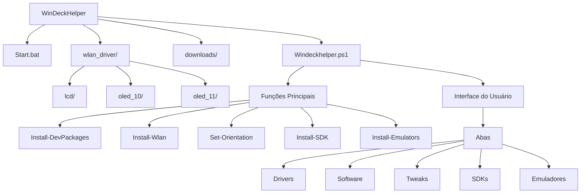

# Diretrizes de IA - WinDeckHelper

**Versão:** 1.0.0 (Diretrizes Iniciais para IA)

## 1. Visão Geral

Este documento estabelece as diretrizes para modelos de IA trabalharem no projeto WinDeckHelper, focando em:

* Compreensão da estrutura do projeto
* Padrões de modificação de código
* Processos de validação
* Diretrizes específicas para interação com o código

## 2. Estrutura do Projeto

### 2.1 Mapa de Componentes



### 2.2 Componentes Principais

| Componente | Responsabilidade | Restrições | Validações Necessárias |
|------------|------------------|------------|------------------------|
| `Start.bat` | Inicialização com privilégios | Não modificar parâmetros de execução | Verificar permissões de admin |
| `Windeckhelper.ps1` | Script principal | Manter estrutura de funções | Testar todas as funções modificadas |
| `downloads/` | Armazenamento temporário | Limpar após instalação | Verificar espaço disponível |
| `wlan_driver/` | Drivers de rede | Manter compatibilidade | Testar em todas as versões do Windows |

## 3. Diretrizes de Modificação

### 3.1 Funções de Instalação

* **Padrão de Implementação:**
```powershell
function Install-Package {
    param(
        [string[]]$Packages
    )
    try {
        Show-Progress -Status "Iniciando..." -Phase "Instalação"
        # Lógica de instalação
        Show-Progress -Status "Concluído" -Phase "Finalização"
    }
    catch {
        Write-Error "Erro: $_"
    }
}
```

### 3.2 Validações Obrigatórias

* Verificar existência de diretórios antes de instalação
* Validar URLs de download
* Confirmar versões de pacotes
* Testar permissões de escrita
* Verificar dependências

## 4. Áreas de Responsabilidade

### 4.1 Instalação de Software

* Manter URLs atualizadas
* Implementar verificações de versão
* Garantir instalação silenciosa
* Validar pós-instalação

### 4.2 Configuração de Drivers

* Verificar compatibilidade com Windows
* Implementar fallbacks
* Manter logs de instalação
* Validar assinaturas digitais

### 4.3 Gerenciamento de SDKs

* Organizar por plataforma
* Validar dependências cruzadas
* Manter variáveis de ambiente
* Documentar processo de instalação

## 5. Padrões de Código

### 5.1 Funções PowerShell

* Usar verbos aprovados (Install-, Set-, Get-, etc.)
* Implementar tratamento de erros
* Documentar parâmetros
* Retornar valores consistentes

### 5.2 Interface do Usuário

* Manter padrão visual
* Implementar feedback de progresso
* Garantir mensagens claras
* Validar interações do usuário

## 6. Validações de Qualidade

### 6.1 Checklist de Modificação

**Antes:**
- [ ] Analisar código existente
- [ ] Identificar dependências
- [ ] Documentar funcionalidade atual

**Durante:**
- [ ] Seguir padrões de código
- [ ] Implementar tratamento de erros
- [ ] Manter logs adequados

**Depois:**
- [ ] Testar modificações
- [ ] Atualizar documentação
- [ ] Validar compatibilidade

### 6.2 Critérios de Aceitação

* **Funcionalidade:**
  - Instalação bem-sucedida
  - Configuração correta
  - Logs adequados
  - Tratamento de erros

* **Compatibilidade:**
  - Windows 10/11
  - Diferentes versões de PowerShell
  - Arquiteturas x86/x64

## 7. Restrições e Limitações

### 7.1 Ações Proibidas

* Modificar estrutura base do script
* Alterar lógica de elevação de privilégios
* Remover validações existentes
* Modificar padrões de UI estabelecidos

### 7.2 Áreas Sensíveis

* Instalação de drivers
* Modificações de registro
* Configurações de sistema
* Gerenciamento de serviços

## 8. Diretrizes para Modelos de IA

### 8.1 Prioridades de Análise

1. Verificar segurança das operações
2. Validar URLs e downloads
3. Garantir tratamento de erros
4. Manter padrões de UI
5. Documentar modificações

### 8.2 Padrões de Resposta

* Explicar modificações propostas
* Fornecer contexto das alterações
* Indicar possíveis impactos
* Sugerir testes necessários

### 8.3 Validações Obrigatórias

* **Segurança:**
  - Verificar URLs
  - Validar hashes
  - Confirmar permissões
  - Checar assinaturas

* **Funcionalidade:**
  - Testar instalações
  - Validar configurações
  - Verificar logs
  - Confirmar limpeza

### 8.4 Boas Práticas para Prevenção de Erros em PowerShell

* **Formatação de Strings:**
  - Nunca usar `$_` diretamente após caracteres especiais como `:` ou `-`
  - Sempre usar uma variável intermediária: `$errorMsg = $_.Exception.Message`
  - Quando necessário usar variáveis em meio a texto com caracteres especiais, utilizar chaves: `${variavel}`
  - Em mensagens de erro, seguir o formato: `Write-Error "Mensagem de erro: $errorMsg"`

* **Tratamento de Exceções:**
  - Sempre capturar propriedades específicas: `$_.Exception.Message` em vez de `$_`
  - Para logs extensivos, armazenar em variáveis antes: `$stackTrace = $_.ScriptStackTrace`
  - Em blocos MessageBox, nunca usar `$_` diretamente: `[System.Windows.Forms.MessageBox]::Show("Erro: $errorMsg")`
  - Documentar o tipo de exceção esperada nos comentários

* **Exemplos Corretos:**
```powershell
try {
    # Lógica da operação
}
catch {
    $errorMsg = $_.Exception.Message
    $stackTrace = $_.ScriptStackTrace
    Write-Error "Erro ao processar ${operacao}: $errorMsg"
    [System.Windows.Forms.MessageBox]::Show("Ocorreu um erro: $errorMsg", "Título do Erro")
}
```

### 8.5 Técnicas para Edição Eficiente de Arquivos Grandes

* **Localização Precisa de Código:**
  - Usar Select-String para identificar linhas exatas para edição:
  ```powershell
  Select-String -Path .\Arquivo.ps1 -Pattern 'PadrãoBusca' | ForEach-Object { "Linha $($_.LineNumber): $($_.Line.Trim())" }
  ```
  - Para padrões com caracteres especiais, escapar com `\`: `'Write-Error.*\$_'`
  - Combinar com outros critérios para refinar resultados: `'catch.*Write-Error.*\$_'`

* **Abordagem para Edições:**
  1. Usar Select-String para identificar todas as ocorrências do problema
  2. Categorizar os resultados por padrão ou contexto
  3. Editar as ocorrências uma a uma, verificando o contexto com `read_file` antes de cada edição
  4. Confirmar cada alteração antes de prosseguir para a próxima

* **Exemplos de Comandos:**
  ```powershell
  # Localizar todas as mensagens de erro problematicas
  Select-String -Path .\Arquivo.ps1 -Pattern 'Write-Error.*\$_' | ForEach-Object { "Linha $($_.LineNumber): $($_.Line.Trim())" }
  
  # Localizar todas as MessageBox problematicas
  Select-String -Path .\Arquivo.ps1 -Pattern 'MessageBox.*\$_' | ForEach-Object { "Linha $($_.LineNumber): $($_.Line.Trim())" }
  
  # Verificar contexto antes de editar
  Get-Content .\Arquivo.ps1 | Select-Object -Index ($LineNumber-3)..($LineNumber+3)
  ```

## 9. Manutenção e Atualizações

### 9.1 Processo de Atualização

1. Verificar URLs atualizadas
2. Validar novas versões
3. Testar compatibilidade
4. Atualizar documentação

### 9.2 Documentação

* Manter registro de mudanças
* Atualizar instruções
* Documentar problemas conhecidos
* Registrar soluções implementadas