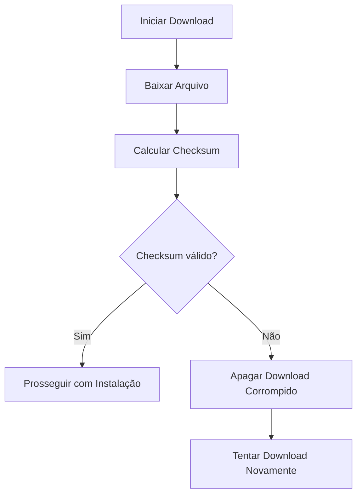

# Avaliação Profunda do Projeto Environment Dev

## 1. Propósito Principal
- Sistema modular para instalação/configuração de ambientes de desenvolvimento
- Foco em desenvolvimento retro (Game Boy, SNES, Mega Drive) e dual boot
- Suporte a múltiplos métodos de instalação (exe, msi, pip, vcpkg, scripts)
- Interface CLI e GUI

## 2. Pontos Fortes
- Arquitetura modular bem definida
- Documentação abrangente (incluindo análise de robustez)
- Sistema de logging detalhado
- Suporte a múltiplas plataformas (Windows, WSL)
- Gerenciamento de dependências complexas
- Verificação de pré-requisitos (conexão, espaço em disco)

## 3. Oportunidades de Melhoria
- Testes automatizados ausentes
- Verificação de integridade de downloads (checksum)
- Rollback em falhas de instalação
- Documentação de casos de uso complexos
- Suporte a mais distribuições Linux no dual boot

## 4. Plano de Melhorias

### 4.1 Verificação de Checksum

### 4.2 Testes Automatizados
- Implementar testes unitários para módulos principais
- Criar testes de integração para fluxos complexos
- Adicionar CI/CD com GitHub Actions

### 4.3 Melhor Tratamento de Erros
- Adicionar rollback para operações falhas
- Melhorar mensagens de erro para usuários finais
- Implementar recuperação de estado após falhas

### 4.4 Documentação Avançada
- Adicionar exemplos de configuração complexa
- Documentar cenários de edge cases
- Criar guia de solução de problemas

### 4.5 Suporte a Distribuições Linux
- Adicionar suporte a Ubuntu, Fedora, Arch Linux
- Implementar verificações específicas por distro
- Criar scripts de pós-instalação customizados