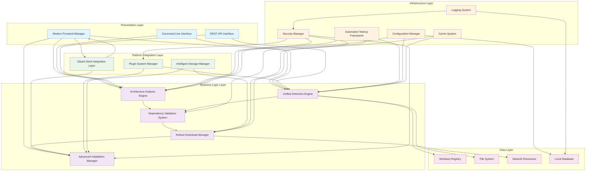
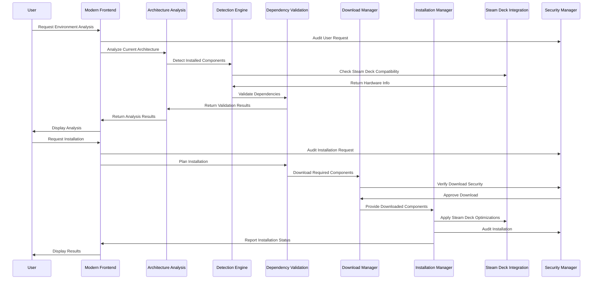
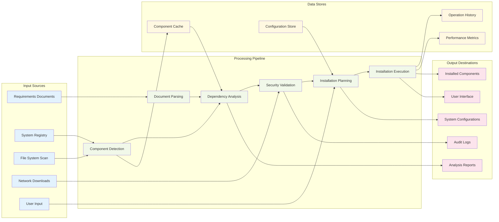
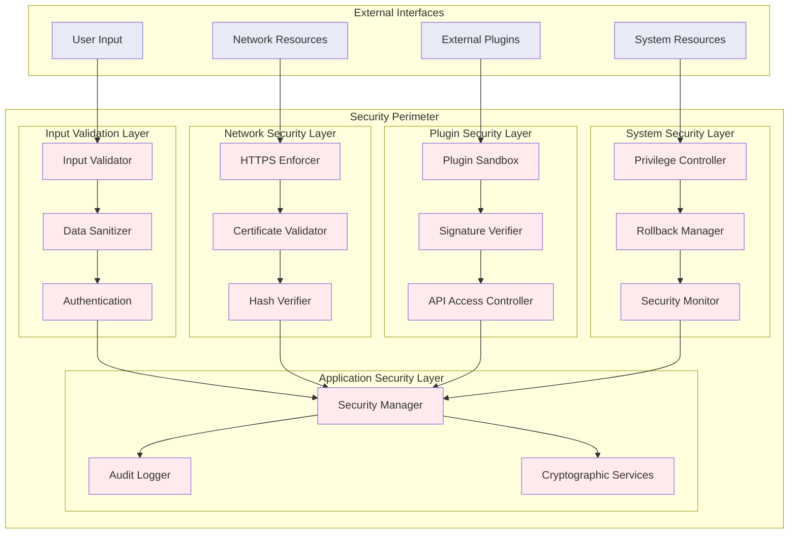
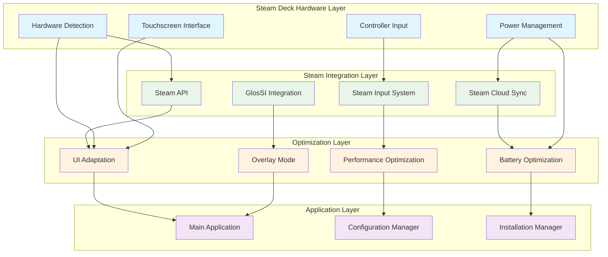
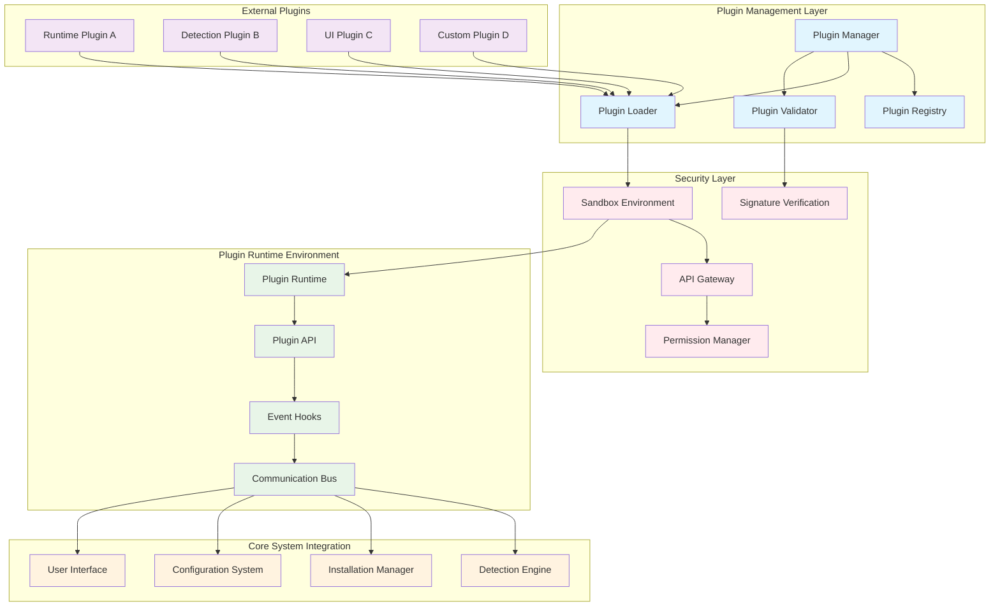
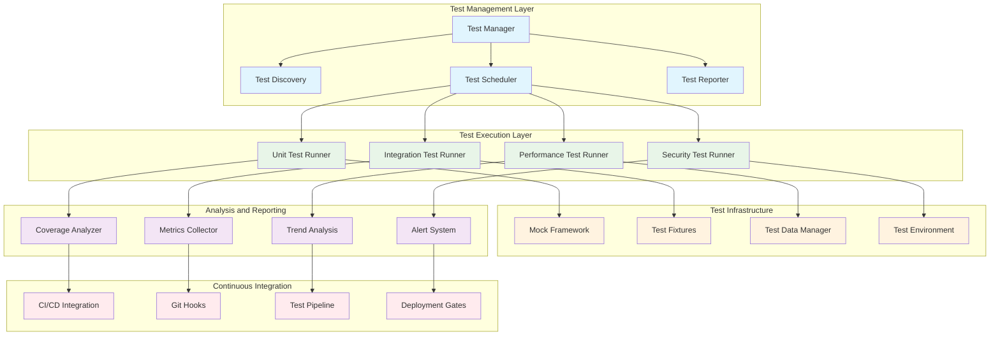
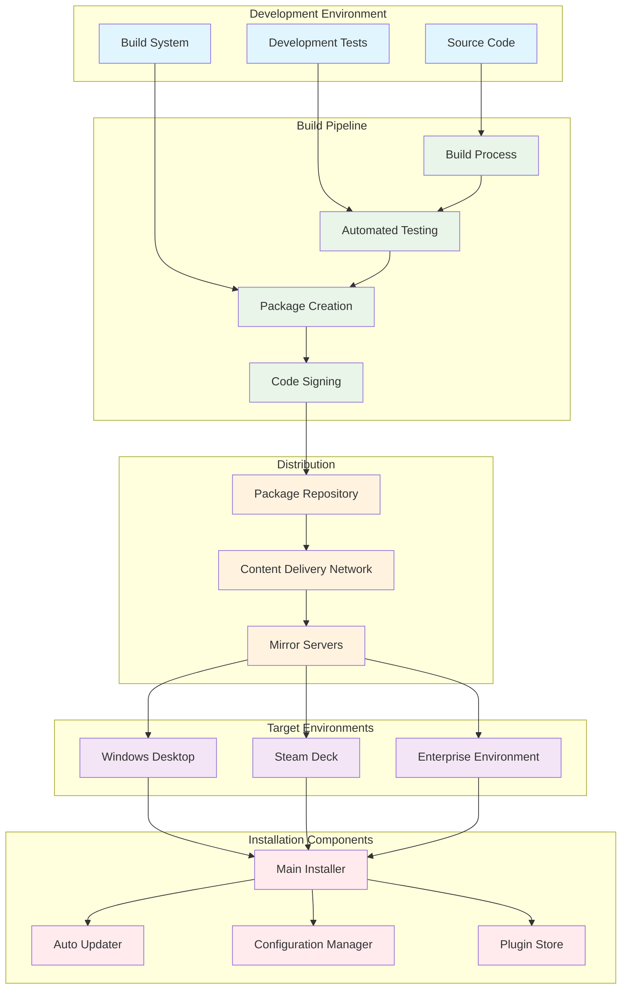
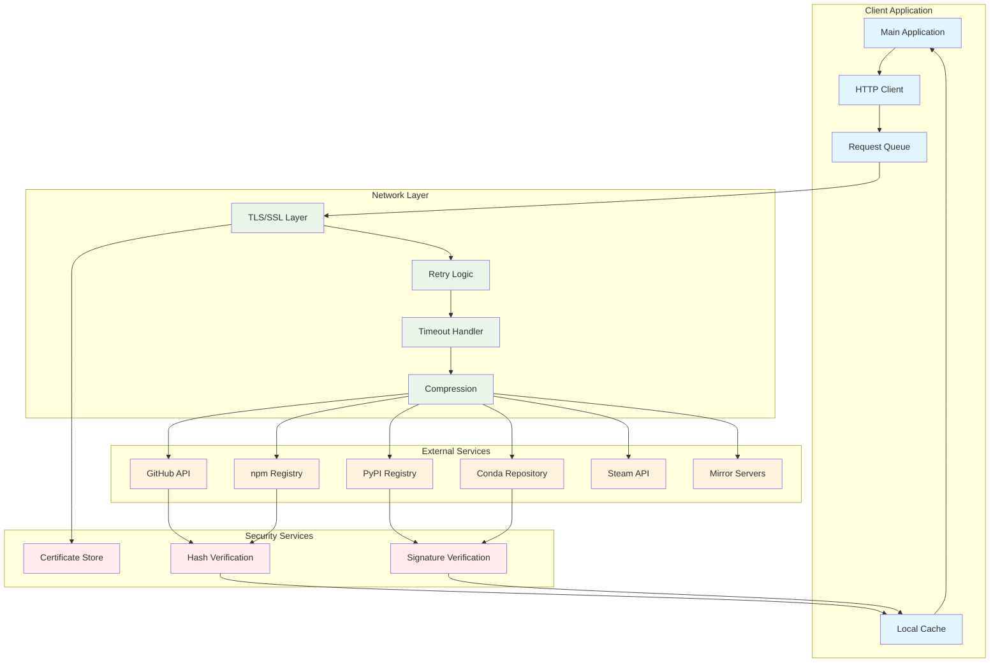
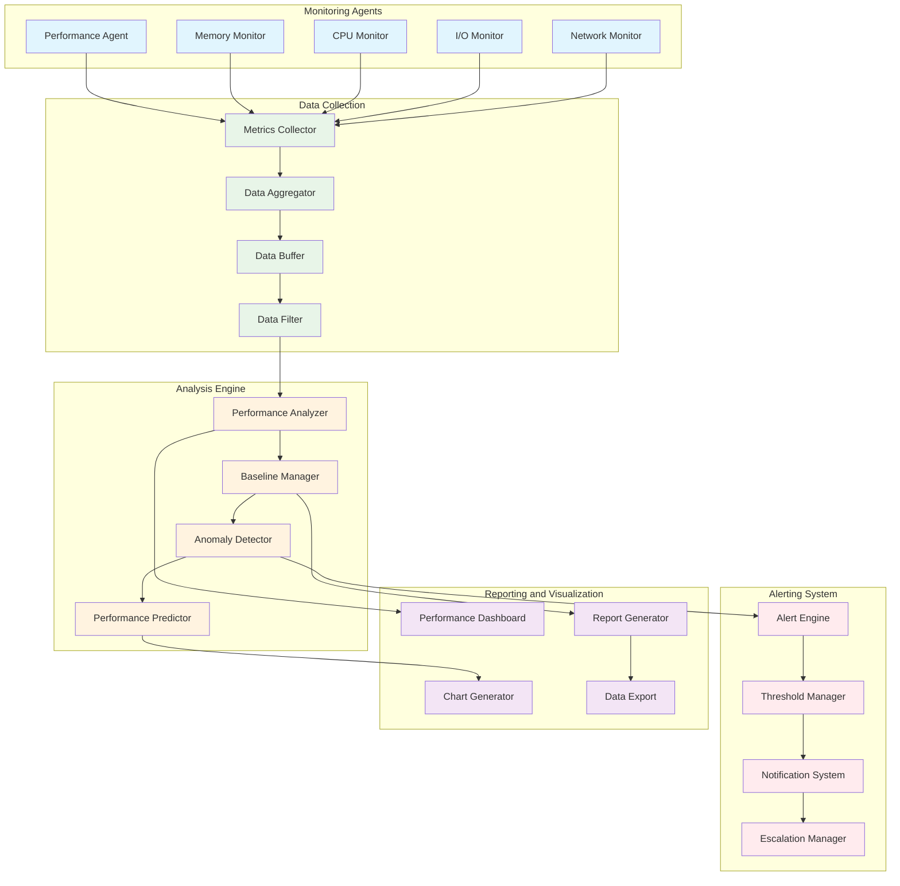

# Environment Dev Deep Evaluation - Architecture Diagrams

## System Architecture Overview

This document contains comprehensive architecture diagrams for the Environment Dev Deep Evaluation system, illustrating the relationships between components, data flow, and system interactions.

## High-Level System Architecture

## Component Interaction Diagram

## Data Flow Architecture

## Security Architecture Diagram

## Steam Deck Integration Architecture

## Plugin System Architecture

## Testing Framework Architecture

## Deployment Architecture

## Network Communication Architecture

## Performance Monitoring Architecture

## Conclusion

These architecture diagrams provide a comprehensive view of the Environment Dev Deep Evaluation system's structure and interactions. The diagrams illustrate:

1. **Modular Design**: Clear separation of concerns across different layers
2. **Security Integration**: Security considerations embedded throughout the architecture
3. **Steam Deck Optimization**: Dedicated architecture for Steam Deck integration
4. **Extensibility**: Plugin system architecture supporting unlimited extensions
5. **Reliability**: Comprehensive testing and monitoring architecture
6. **Performance**: Optimized data flow and processing pipelines
7. **Scalability**: Distributed architecture supporting growth

The architecture supports all system requirements while maintaining flexibility for future enhancements and evolution.